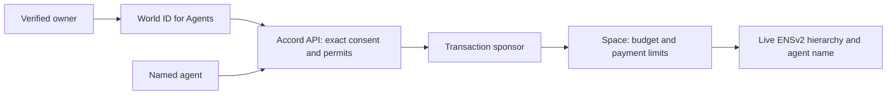

# Accord

A verified person delegates a revocable budget to an ENS-named agent. **Spaces** hold six-decimal test tUSDC on Ethereum Sepolia. The owner authorizes an agent after fresh World ID verification; the Space issues its real ENSv2 subname. Routine payments run within the budget, while sensitive payments wait for the owner to verify and approve the exact amount and recipient.

Both controls remain necessary: an approval cannot rescue a revoked ENS identity, and a valid name cannot skip required human consent. The Space contract checks the signed permit, live ENS hierarchy, budgets and replay protection. The API authorizer is trusted to validate World authentication and consent. Transactions use the existing ERC-2771 sponsor; users sign requests and do not need Sepolia ETH. Intercepta is excluded from this version.

- [Live app](https://accord.hrsh.dev)
- [Public demo — inspect approved, denied and revoked purchases](https://accord.hrsh.dev/demo)
- [Four-point implementation plan and prize mapping](docs/ens-world-integration-plan.md)
- [Agent developer toolkit plan — SDK, CLI and MCP](docs/agent-developer-toolkit-plan.md)
- [Install and connect an agent — SDK/MCP quickstart](packages/agent-kit/README.md)
- [Developer setup in the app](https://accord.hrsh.dev/developers)
- [Live SDK/MCP purchase, denial and ENS revocation evidence](docs/agent-toolkit-live-evidence.md)
- [Curvegrid AI Agent: requirements, implementation and evidence](docs/curvegrid-ai-agent.md)
- [Demo walkthrough](docs/demo-guide.md)
- [Four-minute video script and recording setup](docs/demo-video-script.md)
- [PM2 / Vercel deployment](docs/deployment.md)
- [Public contract manifest](deployments/ens-world-sepolia.json)
- [Integration feedback and evidence](docs/integration-feedback.md)



## The main journey

1. **Create a Space** and claim free tUSDC using the repeatable **Get 1,000 tUSDC** faucet.
2. **Give someone a budget → An agent → Connect your agent**. Create a local toolkit signer and open its pairing link, then choose the name, budget, caps, expiry and approval threshold. Advanced users can still enter a signer address manually.
3. Fund the inert allocation, review the terms, complete fresh World authentication, then explicitly **Authorize agent**. This provisions the ENSv2 subname and signs the exact mandate. Increasing funding, raising caps, extending expiry, changing identity or lowering the approval threshold needs fresh verification by the same person. Reductions and revocation remain available without a World check.
4. The agent pays from its allocation. Above-threshold payments appear in the owner's **Needs your approval** inbox. The owner verifies freshly, then **Approve payment** or **Deny**. The agent resumes the same request and permit.
5. **Revoke ENS** unregisters the name through its namespace. The next payment fails even if an approval/signature was issued earlier. **Close** recovers the remaining funds.

The Namespace operator holds ENS root roles; agent name tokens receive no transfer, renewal, resolver or administrator permissions. The backend stores registration resources and binds the full hierarchy in the onchain adapter. Re-registering a label does not restore old permits.

Person allowances remain supported. Their fixed beneficiary enrolls with IDKit and verifies freshly for each claim. Assigned allowances appear under **Shared with you**. IDKit enrollment and the World Agents owner identity are separate credentials; neither is silently substituted for the other. The small unlink icon resets IDKit enrollment for demo recording, without erasing history or changing agent approval identity bindings.

## Curvegrid: Best AI Agent Project

Accord gives an external assistant tools to inspect its budget, quote and purchase repository research, request human approval, and retrieve the paid result and receipt. The Space enforces financial limits and live ENS authority; the API validates the same owner's World authentication and exact consent. The SDK and MCP connector preserve the purchase across approval and restart without charging again.

This matches the payment-agent and policy-aware-agent use cases in [Curvegrid's prize brief](https://ethglobal.com/events/tokyo2026/prizes/curvegrid). **MultiBaas is not used**; the brief makes its integration optional. There is no MultiBaas integration feedback to report. See the [implementation and evidence guide](docs/curvegrid-ai-agent.md) and the [assistant demo walkthrough](docs/demo-guide.md#assistant-purchase-demo).

## Team

**Harsh Gupta** — creator and developer of Accord. GitHub: [@hrsh22](https://github.com/hrsh22).

## Run locally

Requires Node 24+, pnpm 11 and Foundry for contract work.

To try the agent tools against the hosted app, use the [standalone quickstart](packages/agent-kit/README.md); no backend credentials or local database are needed. For a self-hosted app, copy the environment template below, then configure your own backend credentials and the current deployment addresses from the [manifest](deployments/ens-world-sepolia.json) before starting the services.

```bash
pnpm install --frozen-lockfile
cp -n .env.example .env
pnpm --filter @accord/api db:migrate
pnpm dev
```

The frontend runs at `http://localhost:3000` and rewrites `/api` to the backend. Configure `API_URL`, `NEXT_PUBLIC_SEPOLIA_RPC_URL` and `NEXT_PUBLIC_REOWN_PROJECT_ID`. Keep backend signing keys, RPC credentials and the World client key in the root `.env` / private server files. Only public browser configuration belongs in Vercel.

The API uses persistent SQLite at `.data/accord.sqlite` and exactly one PM2 process. The configured production origin is `https://accord.hrsh.dev`; localhost sign-in is rejected while using that production origin. See the deployment guide for updates, migrations, backups and the separate OIDC callback hostname.

World Agents uses the registered official sandbox client with `private_key_jwt`, S256 PKCE and fresh authentication. The callback validates signature, issuer, audience, nonce, `auth_time`, Orb ACR and proof-of-possession AMR. The event environment uses mocked identities; a successful sandbox run is not production biometric assurance.

## Tests and demo tools

`pnpm check` runs type checks, lint, unit tests, Foundry tests and production builds. API tests use isolated in-memory databases and explicitly mocked identity/chain responses. They cover consent, exact terms, wrong sessions/subjects, stale callbacks, denial, expiry, ENS changes and cached permits. Contract tests independently enforce budgets, hierarchy invalidation, signed agent funding and replay prevention.

After installing dependencies, run the complete verification from the repository root. Ensure `forge` is on your PATH:

```sh
pnpm check
```

For focused review of the agent permission boundary, source collection, retry handling and onchain limits:

```sh
pnpm --filter @accord/api... --filter @accord/agent... build
pnpm --filter @accord/agent test
pnpm --filter @accord/api exec vitest run src/toolkit.test.ts src/repository-research.test.ts
forge test --root contracts
```

These isolated tests do not require a live World login or funded wallet. Actual provider and Sepolia evidence is documented separately in the [live toolkit results](docs/agent-toolkit-live-evidence.md).

`apps/api/scripts/deploy-ens-world.mts` previews/resumes the current ENS namespace, adapter and factory deployment; `--broadcast` sends transactions. `demo-ens-world.mts` uses the real API and World callback with test wallets; it never inserts a verified identity or policy. `verify-agent-ens.mts` checks real resolver records and rejected agent permission changes. The older local browser/onchain fixtures predate the new agent model and are not proof of this integration.

`packages/agent-kit` provides the installable `@accord/agent` SDK, CLI and local stdio MCP server. It connects through an ENS name and owner-approved signer pairing. Scoped credentials cannot call owner routes or cross allocation boundaries. `apps/agent-demo` is a deterministic example using the same runtime and a paired local profile. It prints pending approval/submission states and resumes the same quote ID on a later invocation. Real public GitHub research costs 1 tUSDC for a snapshot or 20 for comparison evidence; delivery requires the exact confirmed payment. See the package README for setup, idempotency and recovery.

Current contracts and infrastructure transaction hashes are recorded in the [deployment manifest](deployments/ens-world-sepolia.json). Old demo data was backed up before cleanup; old immutable contracts remain on Sepolia but are no longer the app's active deployment.
