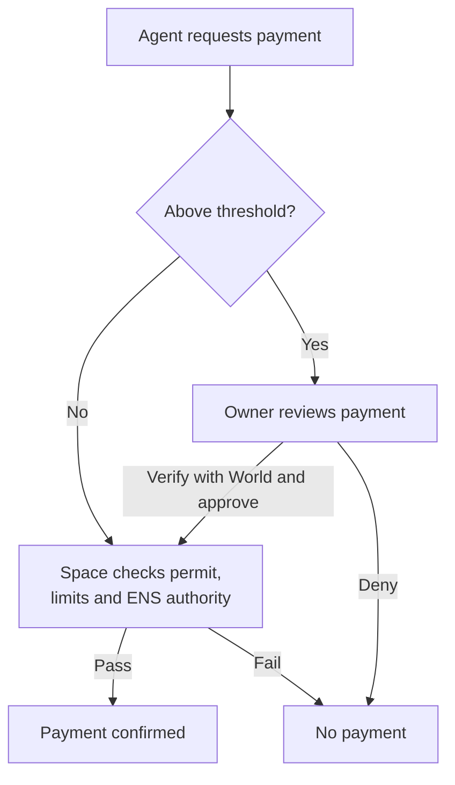
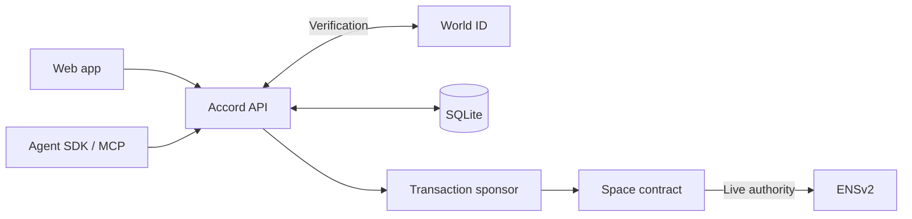

# Accord

**Allowances for humans and their AI agents.**

Accord lets you give a person or an AI agent a budget while keeping control over how it is spent. Funds live in a **Space**, a smart contract that enforces spending rules. People claim allowances with World ID. Agents pay for services within their limits and ask you to approve larger purchases.

[Open the app](https://accord.hrsh.dev) · [Explore the demo](https://accord.hrsh.dev/demo) · [Connect an agent](packages/agent-kit/README.md)

The demo runs on **Ethereum Sepolia** with free **tUSDC test tokens**. Accord sponsors transaction fees, so users do not need Sepolia ETH. The agent approval flow uses the World sandbox with test identities.

## What can you do?

| For people | For AI agents |
| --- | --- |
| Set up a stipend, grant or recurring allowance. | Give an assistant a budget for paid tools and services. |
| Recipients find allowances under **Shared with you** and verify with World ID for each claim. | Connect through the SDK or MCP (Model Context Protocol), using a dedicated signer and an ENS name. |
| Choose how much can be claimed per period and when the allowance ends. | Set a total budget, daily cap, per-payment cap, expiry and threshold for owner approval. |

## How it works

1. **Create a Space.** Connect your wallet and use **Get 1,000 tUSDC** to collect free test tokens.
2. **Give someone a budget.** Choose a person or pair an agent, set its rules, and fund the allocation.
3. **Authorize an agent.** Verify with World ID and approve the exact budget terms. Accord issues the agent an ENS subname under its Space. Increasing its authority requires fresh verification by the same owner.
4. **Claim or spend.** People verify each claim. Agents make routine payments within their limits; payments above the approval threshold wait in your **Needs your approval** inbox.

An agent payment follows this path:



**Example:** give a research agent 100 tUSDC, a 25 tUSDC per-payment cap, and require approval above 10 tUSDC. It can buy a **1 tUSDC repository snapshot** from the included research service within its limits. A **20 tUSDC comparison** waits for you to verify and approve the exact amount and recipient. The agent then resumes the same purchase to retrieve its report and receipt.

You can deny a request, **Revoke ENS** to stop future spending, or **Close** the allocation to recover the remainder. Revoking the ENS name blocks even a previously approved payment that has not executed.

## Under the hood



The **API** validates World verification and owner consent, stores approval and purchase state, and signs payment permits. The **Space contract** checks those permits, enforces budgets and expiry, rejects reused requests, and checks the agent's live ENS authority before moving tokens. The sponsor submits signed transactions and pays the network fees.

The API is a trusted authorizer and operates the ENS namespace. World verification and human consent are checked by the API; they are not independently verified by the contract. Person claims use IDKit, while agent owner approvals use the separate World ID for Agents flow.

| Directory | Purpose |
| --- | --- |
| [`apps/web`](apps/web) | Next.js interface for Spaces, allowances and approvals. |
| [`apps/api`](apps/api) | Effect API, World verification, ENS registration, transaction sponsorship and SQLite storage. |
| [`contracts`](contracts) | Solidity contracts for Spaces, spending rules, ENS authority and sponsored transactions. |
| [`packages/agent-kit`](packages/agent-kit) | Agent SDK, CLI and local MCP server. |
| [`apps/agent-demo`](apps/agent-demo) | Runnable SDK example for the research purchase flow. |
| [`packages/sdk`](packages/sdk), [`packages/api-contract`](packages/api-contract), [`packages/chain`](packages/chain) | Shared API client, schemas and contract bindings. |

## Run locally

Requires **Node.js 24+** and **pnpm 11**. Install **Foundry** for contract work and the full test suite.

To connect an agent to the hosted app without running the backend, follow the [agent toolkit quickstart](packages/agent-kit/README.md).

For the full application, run these commands from the repository root:

```sh
pnpm install --frozen-lockfile
cp -n .env.example .env
```

Before starting, configure `.env` using the [environment template](.env.example) and [deployment guide](docs/deployment.md):

- Set your Reown project ID, Sepolia RPC URLs and deployment addresses. Backend signing keys must match the configured contracts and ENS namespace.
- Configure your World credentials and registered callback for verification flows, plus a sponsor wallet funded with Sepolia ETH.
- For local sign-in, use `WEB_ORIGIN=http://localhost:3000` and `API_URL=http://localhost:4000`. Keep private keys and credentials in the backend environment.

```sh
pnpm --filter @accord/api db:migrate
pnpm dev
```

Open **http://localhost:3000**. The web app proxies `/api` to the backend on port **4000**; SQLite data is stored in `.data/accord.sqlite` by default.

To run type checks, lint, unit tests, Foundry tests and production builds:

```sh
pnpm check
```

## More details

- [Demo walkthrough](docs/demo-guide.md) — try claims, purchases, approvals, denial and revocation.
- [Agent toolkit](packages/agent-kit/README.md) — installation, MCP setup, SDK usage and purchase recovery.
- [Live integration evidence](docs/agent-toolkit-live-evidence.md) — recorded purchase, denial and ENS revocation checks.
- [ENS and World integration](docs/ens-world-integration-plan.md) — identity model, permission boundaries and prize mapping.
- [Curvegrid AI Agent submission](docs/curvegrid-ai-agent.md) — implementation and supporting evidence.
- [Deployment](docs/deployment.md) and [transaction batching](docs/transaction-batching.md) — hosting, configuration and sponsored transactions.

Built by **[Harsh Gupta](https://github.com/hrsh22)** for ETHGlobal Tokyo 2026.
