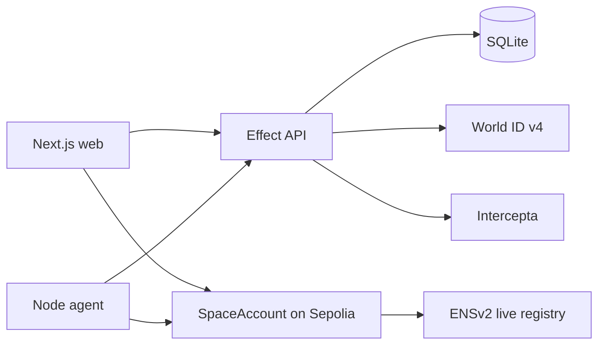

# Accord

Accord is a permission protocol for moving ERC-20 tokens on Ethereum Sepolia. A **Space** holds one token. Its owner creates an **Allocation** for a person or a capped **Mandate** for an agent. Claims require a fresh, action-bound World ID session proof; agent payments require live ENSv2 authority and Intercepta recipient screening before the API signs a short-lived permit. The person or agent submits the final transaction from their own wallet. The API signer is trusted to perform the offchain World and Intercepta checks; the contract enforces the signed permit and live ENS authority.

See the concise [product plan](research/accord-plan.md) and [implementation plan](research/accord-implementation-plan.md).

The [demo guide](docs/demo-guide.md) covers the paid-report task, standalone agent, live demo script, and source pointers. [Integration feedback](docs/integration-feedback.md) records completed checks and pending live evidence.

Owners can share a Space link so recipients can inspect its rules and transaction history before connecting their permitted wallet. Confirmed activity links to receipts, and the browser can recover a paid report after refresh without requesting another payment. `pnpm ready:live` checks deployment and integration readiness without submitting transactions; see the demo guide for its results and remaining manual checks.



## Run locally

Requires Node 24+, pnpm 11, and Foundry. The root `.env` is gitignored; copy `.env.example` if starting fresh. The default `DATABASE_FILE` stores SQLite at `.data/accord.sqlite` in the repo root. Set `WORLD_APP_ID`, `WORLD_RP_ID`, and `WORLD_RP_SIGNING_KEY` for World integration. Keep signing and Intercepta keys server-only.

```bash
pnpm install
cp -n .env.example .env
pnpm --filter @accord/api db:migrate
pnpm dev
```

The database lives at `.data/accord.sqlite`; keep that file when restarting or backing up the local app. The previous PostgreSQL migrations and a one-time `db:import-postgres` script remain for existing installs. For a hosted API, put SQLite on persistent storage and run a single API instance.

The web app is at `http://localhost:3000`; its `/api` path proxies to the Effect API on port 4000. Set `NEXT_PUBLIC_REOWN_PROJECT_ID` in the root `.env` to a project ID from the [Reown Dashboard](https://dashboard.reown.com/) and restart the web app to enable Reown AppKit. **Connect wallet** opens a wallet picker for installed browser wallets and WalletConnect. To sign in with the local demo human wallet, choose WalletConnect and copy its pairing link, then run `pnpm wallet:demo` in a terminal and paste the link when prompted. This test wallet reads `DEMO_HUMAN_PRIVATE_KEY` locally, accepts only Accord on localhost and Ethereum Sepolia, and signs wallet login messages; it does not submit transactions. A funded Sepolia wallet is needed for browser onchain actions. The home page is your workspace. **Explore demo** opens the public read-only Space. Connect a Sepolia wallet, choose **Sign in**, and use **New Space** to create a draft. A saved draft opens immediately for activation. Active Spaces organize actions into Overview, Allocate, Claim, Agent payments, and Settings; **Open shared Space** accepts an address without requiring sign-in to read it. A template sets the first allocation defaults; any active Space can hold both person allocations and agent budgets. The Space console reads current allocation and mandate terms from Sepolia before a person claims or an agent pays. Owners can revoke agent mandates or close an allocation and recover its unspent tokens; the recovery right appears in the public terms. The API config endpoint supplies the trusted factory, adapter, and permit signer addresses. An activated Space requires a deployed factory, adapter, and token configured in `.env`.

`pnpm check` runs types, lint, unit tests, Foundry tests, and production builds. `pnpm --filter @accord/api smoke:auth` exercises authentication and World rejection checks. With the API running, `pnpm --filter @accord/api smoke:world-request` signs in an ephemeral wallet and asks IDKit to construct a Selfie Check session request from the API's fresh RP challenge; this does not complete a human proof. For local chain integration, start `anvil --port 8546 --chain-id 11155111 --silent` and run `pnpm --filter @accord/api smoke:onchain`; the smoke test creates its own temporary SQLite database. It deploys fixtures and exercises the complete claim, agent payment, revocation, and recovery through the real API and Solidity contracts. World verifier and Intercepta responses are test fixtures loaded only into that dedicated local API process, so this check does not prove live partner acceptance.

For browser testing without a real World proof or Intercepta key, run `pnpm --filter @accord/api e2e:browser`. This launches an isolated Anvil chain, temporary database, API, and web app with visibly simulated partner checks. It supplies a disposable WalletConnect signer capable of local transactions. See [the browser test guide and results](docs/browser-e2e.md). Public Sepolia verification stays enabled.

`pnpm --filter @accord/api deploy:sepolia` previews testnet deployment and checks funds; `deploy:sepolia:broadcast` deploys the contracts with a funded, test-only `DEPLOYER_PRIVATE_KEY`. `ens:sepolia` previews registration of a real ENSv2 test name and `ens:sepolia:broadcast` performs its commit–reveal registration using ENS's free Sepolia MockUSDC. With the API running, `pnpm --filter @accord/api demo:sepolia` creates or rechecks a public Space with separate owner, human, and agent wallets. It renews only its active demo mandate when fewer than seven days remain, and refuses to restore a revoked mandate. It saves resumable public transaction data in gitignored `.codex/accord-sepolia-demo.json`. To make a real wallet the human beneficiary, set the public `DEMO_BENEFICIARY_ADDRESS` in `.env` and run `pnpm --filter @accord/api demo:beneficiary` (or pass the address as a CLI argument); it funds a 5 ACD allocation and enough Sepolia gas for the claim, then verifies the allocation onchain. Once `INTERCEPTA_API_KEY` is set and the API restarted, `demo:sepolia` requests a live screening verdict and, if allowed, submits and checks one agent payment. The Node agent example in `apps/agent-demo` supports other configured payments.

## Integration status

World app `app_0193591d58a09cf60e0dd4f6fe4303e0` and RP `rp_93bf1ee875f88ada` are registered for staging and production; the local app uses production for a real World App user. The browser uses IDKit v4 Selfie Check sessions; the API signs fresh RP challenges, verifies complete proofs with World, and binds claim proof signals to exact permit digests. A real World App session proof has not yet completed. [World's session guide](https://docs.world.org/world-id/idkit/session-proofs) describes the required returning-user flow.

The adapter [`0xa20c…b9603`](https://sepolia.etherscan.io/address/0xa20c2dd5f1b6936f2f0db4ff68f5fae6cbeb9603), factory [`0xebf2…3bab4`](https://sepolia.etherscan.io/address/0xebf216a9f2303877428089fce00ec5993253bab4), and demo token [`0x6ae1…42495`](https://sepolia.etherscan.io/address/0x6ae18ae71dd6ae2bd677d075ecf617e4cc142495) are deployed on Sepolia. The [public demo Space](https://sepolia.etherscan.io/address/0xdF1f8814CfE17e35e682B88e2B6f8C348da913c5) holds 200 ACD in two allocations. Its agent owns `accordtokyodemo26.eth` in the [current ENSv2 Beta registry](https://docs.ens.domains/learn/deployments/) and has an onchain capped mandate. The repeatable script confirms a human claim remains unsigned without World verification and payment authorization returns 503 without an Intercepta key.

The API calls Intercepta's documented [Quick Scan](https://docs.web3antivirus.io/reference/quick-scan-address) for each agent payment authorization and fails closed when the key or live result is unavailable. Its allow rule requires zero toxic score and no traits; Intercepta does not prescribe that threshold. The requested key is still pending, so no live allow/blocked partner verdict or settled agent payment has been claimed. Drafts and issued permits are authorization steps; the wallet must confirm the contract transaction to move assets.

The call is implemented in `apps/api/src/risk.ts` and enforced before signing in `apps/api/src/permits.ts`. Time to first live call remains pending key delivery. Quick Scan's documented response maps cleanly to our fixture tests. The Web3 Antivirus/Intercepta naming split took extra navigation; an event quickstart combining headers, network coverage, sample responses, and known-risk addresses would help. We will record live latency and schema feedback after receiving the key.
