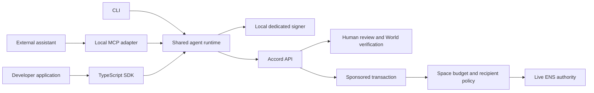

# Accord agent developer toolkit

**Status:** planned; toolkit implementation has not started.

**Updated:** 26 September 2026.

## Product goal

Let someone connect their own agent, give it a named and revocable spending budget, and watch it complete a useful paid task. Give other developers the same capability through an installable SDK, CLI and MCP server.

The distinction in the product becomes concrete:

| Person allowance | Agent budget |
| --- | --- |
| A beneficiary verifies and claims funds to their own wallet. | Software obtains quotes, requests payments, waits for human decisions and retrieves purchased results. |
| The beneficiary initiates each claim. | The agent can act repeatedly within an explicitly delegated policy. |
| World ID protects the claim. | ENS authority, contract limits and human approval jointly constrain spending. |

A wallet identifies the signer; it does not prove that the signer is AI. World verifies the responsible human in the event environment. ENS names the delegated authority. The toolkit makes that authority usable by actual agent software.

This extends the [four-point ENS and World implementation](ens-world-integration-plan.md). Its existing identity, approval, revocation and sponsored-payment controls remain the foundation.

## First release decisions

- **Ethereum Sepolia and six-decimal tUSDC only.** Keep the existing faucet and sponsor. A connected agent needs no ETH balance.
- **One shared runtime**, exposed through a TypeScript SDK, CLI and local MCP server. Use Node 24+, matching this repository.
- **Local stdio MCP first.** The user's assistant launches the connector; its signer stays on that machine. Hosted HTTP MCP and its separate authorization model are later work. Stdio is a standard MCP transport; protocol messages use stdout and diagnostics use stderr. [MCP server guide](https://modelcontextprotocol.io/docs/2026-07-28/develop/build-server)
- **A dedicated agent signer by default.** Pairing avoids copying private keys, draft IDs or allocation IDs into prompts or configuration.
- **One real example service:** a Space spending report using chain data, with a receipt and a result the agent summarizes. Describe it accurately as a spending report; arbitrary web research is outside this release.
- **An external assistant is the first live agent demonstration.** A hosted “Try a demo agent” experience follows using the same runtime, with explicit model and signer configuration.
- Keep person allowances, the existing page structure, and current Spaces working. No database reset is needed for the toolkit. Contract changes require a versioned rollout described below.

## What we can reuse

| Existing implementation | Remaining work |
| --- | --- |
| [`packages/sdk`](../packages/sdk/src/index.ts): typed API client, sessions, payment decisions, approval requests and report endpoints. | High-level agent methods, stable errors and an installable public artifact. The current package is private and depends on workspace packages. |
| [`apps/agent-demo`](../apps/agent-demo/src/index.ts): local signing, quote → authorization → sponsored payment → report, and approval polling. | Extract reusable logic; add pairing, durable operations and restart recovery. The current runner is scripted, not an LLM agent. |
| [`apps/api/src/auth.ts`](../apps/api/src/auth.ts): signed challenges and bearer sessions. | Explicit agent session scopes and revocable connections. `client: "agent"` currently chooses token delivery; it is not a permission boundary. |
| Existing World review pages, ENS namespaces/subnames, permit idempotency and contract replay protection. | Surface those states consistently through SDK/MCP; preserve them through disconnects, retries and policy changes. |
| [`SpaceAccount.pay`](../contracts/src/SpaceAccount.sol): actor, live ENS authority, permit, remaining funds, daily and per-payment checks. | Approved-recipient restrictions. Today any nonzero recipient can receive an otherwise authorized payment. |
| Existing agent budget form, detail view and activity. | Connection setup and a compact developer panel, using the current components. |

## Architecture and package shape

Proposed workspace: `packages/agent-kit`, containing the runtime and thin SDK, CLI and MCP adapters. Keep the low-level internal HTTP client reusable. Migrate `apps/agent-demo` to consume the toolkit so the example exercises the public API.

Start with **one public distribution**, tentatively `@accord/agent`, exporting the SDK and an `accord` executable with an `mcp` subcommand. The name is a proposal: check registry ownership before using it in installation instructions. Bundle the required internal runtime code and declarations, or deliberately publish its dependencies; never ship unresolved `workspace:*` dependencies or require a clone of this monorepo.

The following commands and method names describe the planned interface. They are not available yet.

## 1. Connect an agent without pasting a wallet

### Developer and owner journey

1. Run `accord init` to create a named local profile and dedicated signer, then `accord connect` to begin pairing. Importing an existing signer is an advanced SDK option.
2. The CLI proves possession of that key and prints a short-lived Accord connection URL. Keep the separate polling credential local.
3. The owner opens the URL, signs into Accord and chooses a Space. Show the agent name, key fingerprint, requested access and exact budget terms before accepting.
4. For a new agent, reuse the existing budget form and fresh World authorization flow to issue its ENS name and mandate. Connecting to an existing agent must match its exact signer; attaching tooling alone does not increase authority.
5. The CLI receives the resulting Space, allocation, ENS name and scoped connection. No manual contract addresses or IDs are needed.
6. `accord mcp config` prints a client configuration referencing that local profile. The assistant can now inspect its budget and request a permitted purchase.

Allow the owner to start from **Connect agent** in the web app too; that flow leads to the same pairing review. Keep **Enter a wallet manually** as a secondary advanced option.

### Connection requirements

- Pairing is expiring, single-use and bound to a signer challenge with domain, chain, nonce and expiry. Store pairing secrets hashed, rate-limit attempts and consume acceptance atomically. Opening a link alone must never grant authority.
- The owner chooses the Space/allocation. Never accept those bindings from an untrusted pairing client without ownership checks.
- Issue credentials scoped to a connection, signer, chain, Space, allocation and allowed agent operations. Enforce scopes in every relevant API handler; agent credentials cannot call owner approval, grant, funding or policy-edit endpoints, even if that address owns another Space.
- Keep browser cookies and agent credentials separate. Reauthentication or credential renewal must retain the connection's restrictions. Existing generic agent-session issuance must not provide a bypass.
- Use an OS credential store when available; otherwise a clearly documented owner-readable key file in a private configuration directory. Never place keys or bearer tokens in MCP arguments, tool outputs, telemetry, screenshots or Git.
- **Disconnect tooling** invalidates the connection and its API sessions. **Revoke agent authority** changes onchain authority and stops spending, including cached permits. Explain this distinction in the relevant confirmation modal; disconnect alone cannot invalidate an already signed onchain authorization.

Persist connection/pairing records with expiry, state, scope and revocation timestamps. Existing delegations remain intact; schema changes are additive.

## 2. Make delegated spending policy enforceable

Budget creation should include approved services/recipients alongside the existing total, daily, per-payment, expiry and human-approval settings. Start with a small curated service list, not a marketplace.

- The reviewed policy binds the agent, ENS registration, approved recipient addresses, service IDs and budget settings. A service label resolves to a fixed recipient and supported quote endpoint; remote metadata cannot silently replace that address.
- Add a contract-enforced recipient allowlist to the agent mandate. Bind policy changes to the current signed policy version, invalidate outstanding permits when it changes, and cover direct contract calls as well as sponsored calls.
- The API authorizer enforces service eligibility and immutable quote terms. Bind quote/service identity to the signed purchase details rather than accepting arbitrary metadata. A contract can enforce approved addresses; it cannot attest that an offchain service delivered a useful report.
- Fresh verification by the same owner is required to add recipients/services or otherwise broaden authority. Removing access and revoking remain available without a new World check. Human approval of a payment must not override a disallowed recipient, a cap or revoked ENS authority.
- Apply these checks to all authorization routes, including the existing direct-payment runner and low-level SDK. A restriction in an MCP tool description is not enforcement.

**Deployment consequence:** current immutable Spaces lack the recipient restriction. Deploy and test a new contract/factory version if this policy is included in the release. New Spaces use it; existing Spaces retain their actual capabilities. Do not show an “approved services only” guarantee on an older Space. Offer an explicit migration/recreation path if needed, without silently moving funds or deleting history.

## 3. One durable payment runtime

Extract the existing signer, exact-permit validation, relay and receipt logic. Add a persistent operation journal locally, with authoritative payment/approval records on the API.

| State | Runtime behavior |
| --- | --- |
| `quoted` | Record the service, quote ID, immutable amount/recipient/token/chain, expiry and a stable operation ID. |
| `awaiting_approval` | Return a review URL and request ID promptly; save state. Do not hold an MCP tool call open for several minutes. |
| `ready` | Recheck current authority and exact permit terms; sign only the supported payment call. |
| `submitted` | Save submission identity and transaction hash; reconcile relay/chain state after an uncertain response. |
| `confirmed` | Verify the matching successful payment event, then redeem the same quote. |
| `delivered` | Persist the receipt and result reference; repeated retrieval never creates a payment. |
| `denied`, `expired`, `revoked`, `failed` | Return a stable reason and appropriate recovery action. Denial must not trigger a new approval request automatically. |

Idempotency is a release requirement:

- SDK callers supply a stable operation key; MCP purchases use a persisted quote/operation reference. Retries with changed terms fail. Duplicate or concurrent calls converge on one payment.
- On restart, list and resume existing operations. Query stored submissions and contract events after a timeout before considering another relay attempt. Do not infer failure from a missing HTTP response.
- Retry permit issuance only for the same operation and unchanged terms after confirming payment has not occurred. Respect the current approval, policy version, ENS status and quote expiry.
- An expired quote requires a new quote and explicit new purchase intent. Never quietly increase a price or reuse approval for changed terms.
- Serialize forwarding nonces per signer, including across simultaneous CLI/MCP processes. Preserve the contract's consumed-request protection.
- Use integer base units internally and decimal strings at the user boundary; avoid floating-point currency calculations.

Cancellation is allowed before submission. A submitted transaction must be reconciled; the UI cannot promise to cancel it. Keep local runs and server events free of secrets and full model conversations.

## 4. Developer-facing surfaces

### TypeScript SDK

Expose a small API around a connected profile or injected signer:

| Method, proposed | Purpose |
| --- | --- |
| `getIdentity()` / `getBudget()` | Read the ENS identity, live status, available budget and applicable restrictions. |
| `listServices()` / `getQuote()` | Discover eligible services and obtain immutable purchase terms. |
| `purchase({ quoteId, operationKey })` | Request and, when permitted, execute that purchase; return an explicit state. |
| `getOperation()` / `resumeOperation()` | Inspect or resume the same operation after approval or interruption. |
| `getReceipt()` / `getResult()` | Retrieve payment evidence and the purchased output without paying again. |

Return typed outcomes such as `approval_required`, `recipient_not_allowed`, `budget_exceeded`, `ens_revoked`, `quote_expired` and `service_unavailable`. Include IDs, retryability and review links where applicable. Keep low-level cryptography out of normal application code.

### MCP server

Expose the same operations as focused tools: `accord_identity`, `accord_budget`, `accord_services`, `accord_quote`, `accord_purchase`, `accord_operations`, `accord_resume`, `accord_receipt` and `accord_result`.

Use strict schemas, bounded input sizes and accurate tool annotations. Purchase/resume can mutate state; reads must not. Responses distinguish a requested approval from a confirmed payment. Do not expose arbitrary transaction signing, raw calldata, owner approval or authority changes as agent tools.

Publish short instructions explaining how to choose an allowed service, respect a user/task spending ceiling, surface an approval URL and resume by operation ID. Treat service results as untrusted data, not instructions to change policy or buy something else. Model behavior is not the security boundary: API and contract checks still apply.

Pin a compatible MCP SDK and verify the connector in at least two actual clients. Generate client-specific configuration from tested examples rather than assuming every client supports identical features. [MCP transport specification](https://modelcontextprotocol.io/specification/2026-07-28/basic/transports)

### CLI and public documentation

- `accord init`, `connect`, `status`, `disconnect`: local identity and connection lifecycle.
- `accord doctor`: check network, API, connection, ENS authority, budget and sponsor availability; return actionable errors without printing credentials.
- `accord operations` / `resume <id>`: inspect interrupted work and continue it.
- `accord mcp config` / `accord mcp`: generate configuration and run the stdio connector.

Add a public **Developers** page with an installable quickstart, one copyable MCP configuration, a short TypeScript example, policy/approval behavior, errors and troubleshooting. Supply a runnable example with configuration templates containing no secrets. Verify installation in a clean folder outside this workspace.

## 5. Keep the app's UI focused

- Keep **People and agents**, Activity, Space identity and the existing budget cards in their established hierarchy. Do not redesign the dashboard for this work.
- In the agent setup flow, offer **Connect your agent** and an advanced manual wallet option. After authorization, show the ENS name as the primary agent identity.
- On agent details, add a compact connection status and **Developer tools** action opening the existing sheet/modal pattern. Put connection instructions, last reported tool activity, policy, pending approval and recent receipts there.
- Show a small current-task row when useful: working, waiting for approval, completed or stopped. Reuse the owner's existing approval inbox and exact-payment review page.
- Distinguish a connector heartbeat/tool report from an API-verified payment event. “Connected” describes recent authenticated activity, not proof that a model is running or that a payment succeeded.
- Keep explanations short. Put wallet fingerprints, raw IDs and technical diagnostics behind details. No repeated gas-sponsorship text, large terminals or extra top-level wallet information.
- Preserve the existing demo-only World unlink disclaimer and its small confirmation control. This work does not turn unlink into an agent reset or remove identity bindings from past approvals.

## 6. Demonstration and reusable example

**Task:** “Review this Space's spending capacity and produce a short recommendation using the available spending-report service.”

1. Connect an actual MCP-capable assistant, assign it a named budget and complete owner authorization.
2. The assistant reads its budget, discovers the report service and requests a quote. It buys a basic report within the routine limit, receives real chain data plus a receipt, and summarizes the result.
3. Request the detailed report option above the configured approval threshold but within all spending caps. The assistant surfaces the exact review link, pauses, and resumes the same operation after World verification and explicit approval.
4. Repeat a sensitive request and deny it. Show the agent's stopped state and absence of payment.
5. Approve a separate request, then revoke the agent's ENS authority before execution. Show that the cached authorization cannot spend. Also demonstrate an unapproved recipient being rejected.
6. Restart the connector after a confirmed payment and retrieve its existing result without another charge.

Basic and detailed report options must have defined, distinct outputs and immutable server quotes; today's service has one price and one chain-state snapshot. Do not label the existing scripted runner as an autonomous research agent. Keep it as a deterministic integration example beside the live assistant walkthrough.

### Hosted “Try a demo agent”

After the external path works, add a guided task on the agent page. Reuse the same SDK, policies, review links, receipts and restart behavior. It should run a real model with a bounded task and tool-call limit, not a canned payment animation.

This needs a server-side model credential, a separate protected signer per demo connection, a durable worker and a spending limit for hosted runs. The owner explicitly authorizes that signer; the UI identifies it as hosted by Accord. No owner wallet keys enter the worker. Stop work on cancellation or lost authority, and reconcile any transaction already submitted. External SDK/MCP use must work without Accord configuring this optional hosted model service.

## Implementation order and completion gates

| Phase | Deliverables | Gate before proceeding |
| --- | --- | --- |
| **1. Authority and connection foundation** | Agent-scoped sessions, pairing endpoints/schema, exact owner review, recipient policy and contract capability/version handling. | Pairing replay/expiry/wrong-owner tests; cross-Space and owner-route access rejected; disallowed recipient rejected through direct and sponsored calls; broader authority requires fresh same-person approval. |
| **2. Shared runtime and SDK** | Extract existing runner, persistent operations, quote/permit binding, stable errors, recoverable relay and delivery. | Concurrent retry and restart tests prove one debit and repeatable delivery; denial, expiry, revocation and changed terms stop execution. |
| **3. CLI, MCP and external example** | Local profile, pairing commands, doctor, generated configuration, tools and migrated reference runner. | A developer outside the repository connects and completes a real paid task; two MCP clients exercise approval and resume. |
| **4. Product and demo experience** | Focused connection UI, developer sheet, task/receipt views, report options and recorded live assistant journey. Add hosted demo when its credentials/worker are configured. | Desktop/mobile review against existing pages; visible waiting/denied/revoked states; hosted demo uses identical authority checks. |
| **5. Public developer preview** | Package build, clean-install quickstart, docs, compatibility notes, release/version metadata and evidence links. | Packed artifact works without private workspace packages; exported types, CLI and MCP work in a clean Node 24 environment; publication access and license confirmed. |

**First milestone to implement:** connect an external assistant → obtain one quote → request exact human approval → pay once → return a real report and receipt. Establish this complete path before expanding the service catalog or polishing a hosted agent experience.

Use isolated API databases and contract fixtures for automated tests. Run live Sepolia/World sandbox checks for the final journey. Deploy backend migrations, contract capability support and frontend updates in a compatible order; back up production data before schema or contract rollout. Package publication and production changes belong to implementation, not this planning task.

## Prize alignment and release boundaries

| Target | What the toolkit adds | Evidence |
| --- | --- | --- |
| **ENSv2** | A named identity that external software actually uses, with live hierarchy/expiry/revocation constraining delegated spending. | Real Sepolia registrations, restricted name permissions, receipt under the agent name, and failed payment after revocation. |
| **World ID for Agents** | A genuine agent task requiring a verified person's exact delegation and sensitive-payment approval. | Official event flow, validated result, explicit consent, resumed action, and denied/expired action prevented. |
| **Developer usefulness** | Other teams can reuse Accord's spending controls through an installable connector and SDK. | Public source, clean-install example, working MCP configuration and clear integration documentation. |

The ENS brief asks for ENSv2 to be central to the product with a functional demo and public source. The World Agents brief requires the official event environment, validation before the protected action, and a demonstrated unsuccessful approval path. SDK/MCP packaging strengthens the demonstration; it does not by itself satisfy either integration. [ENS prize requirements](https://ethglobal.com/events/tokyo2026/prizes/ens), [World prize requirements](https://ethglobal.com/events/tokyo2026/prizes/world)

World's event identities are mocked; describe the recorded results as sandbox verification. Keep IDKit's beneficiary flow as a separate supporting demonstration. [World event environment](https://ethglobal.com/events/tokyo2026/prizes/world)

**Outside this release:** other chains/tokens, a service marketplace, arbitrary transaction tools, multi-agent orchestration, hosted HTTP MCP, production identity assurances and Intercepta. Public npm naming/access, a suitable repository license and hosted model credentials are concrete release dependencies to resolve during implementation.
