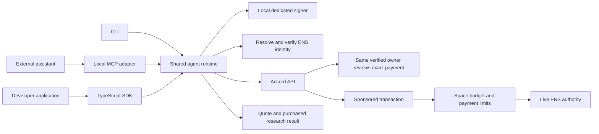

# Accord agent developer toolkit

**Status:** core SDK, CLI and MCP toolkit implemented and deployed. [Live validation evidence](agent-toolkit-live-evidence.md) is recorded; the narrated end-user assistant video remains pending. The design and implementation sequence below are retained as the planning record; see **Implementation progress** for the current state.

**Updated:** 26 September 2026.

**Submission focus:** one useful agent task, connection by ENS name, fresh approval by the same verified person, and a working SDK/MCP quickstart. The broader toolkit follows after this journey is complete.

## Product goal

**Accord lets verified people delegate budgets to named agents. Humans approve sensitive spending, and revoking the agent's ENS authority stops subsequent payments.**

Let someone connect their own agent by its ENS name, give it a revocable spending budget, and watch it complete a useful paid task. Give another developer the same capability through a small installable SDK and MCP connector, with a thin CLI for setup.

The distinction in the product becomes concrete:

| Person allowance | Agent budget |
| --- | --- |
| A beneficiary verifies and claims funds to their own wallet. | Software obtains quotes, requests payments, waits for human decisions and retrieves purchased results. |
| The beneficiary initiates each claim. | The agent can act repeatedly within an explicitly delegated policy. |
| World ID protects the claim. | ENS authority, contract limits and human approval jointly constrain spending. |

A wallet signature establishes control of the key. World establishes continuity with the same verified owner in the event environment. ENS supplies a resolvable identity and revocable delegated authority. The toolkit makes that authority usable by actual agent software; none of these credentials proves that the signer is AI.

This extends the [four-point ENS and World implementation](ens-world-integration-plan.md). Its existing identity, approval, revocation and sponsored-payment controls remain the foundation.

## Submission scope

| Ship for the submission | Follow after the core demonstration |
| --- | --- |
| One TypeScript runtime/SDK and local MCP connector. | Hosted “Try a demo agent,” hosted HTTP MCP and broader client compatibility. |
| Dedicated signer, short pairing flow and connection by ENS name. | Advanced key management and a full CLI suite. |
| One useful repository research service, exact quotes, approvals and receipts. | Additional merchants and a service catalog beyond the single example. |
| Existing budget/ENS enforcement and durable payment recovery. | Contract-enforced recipient/service policy expansion with a versioned deployment. |
| Compact connection UI, a copyable quickstart and a narrated live demo. | Larger developer dashboard and documentation site. |

Recipient restrictions remain planned follow-up work. The submission must describe the actual contract guarantees: agent identity, live ENS authority, budgets, expiry, permits and replay protection. Its service menu describes available tools; it does not guarantee that the agent wallet can only pay those merchants.

- **Ethereum Sepolia and six-decimal tUSDC only.** Keep the existing faucet and sponsor. A connected agent needs no ETH balance.
- **One shared runtime**, exposed through a TypeScript SDK and local MCP server, with minimal setup commands. Use Node 24+, matching this repository.
- **Local stdio MCP first.** The user's assistant launches the connector; its signer stays on that machine. Hosted HTTP MCP and its separate authorization model are later work. Stdio is a standard MCP transport; protocol messages use stdout and diagnostics use stderr. [MCP server guide](https://modelcontextprotocol.io/docs/2026-07-28/develop/build-server)
- **A dedicated agent signer by default.** Pairing avoids copying private keys, draft IDs or allocation IDs into prompts or configuration.
- **One useful example service:** current, source-linked repository research for a developer comparing three tools. Accord operates this example merchant and charges test tUSDC; disclose that relationship. Its output must help with the developer's choice independently of the payment demo.
- **An external assistant is the live agent demonstration.** The same ENS name appears in setup, tool responses, human review and receipts. A hosted agent is not a submission dependency.
- Keep person allowances, the existing page structure, and current Spaces working. Use additive backend changes. The core toolkit requires neither a database reset nor a new Space contract deployment.

## What we can reuse (planning baseline)

| Existing implementation | Remaining work |
| --- | --- |
| [`packages/sdk`](../packages/sdk/src/index.ts): typed API client, sessions, payment decisions, approval requests and report endpoints. | High-level agent methods, stable errors and an installable public artifact. The current package is private and depends on workspace packages. |
| [`apps/agent-demo`](../apps/agent-demo/src/index.ts): local signing, quote → authorization → sponsored payment → report, and approval polling. | Extract reusable logic; add pairing, durable operations and restart recovery. The current runner is scripted, not an LLM agent. |
| [`apps/api/src/auth.ts`](../apps/api/src/auth.ts): signed challenges and bearer sessions. | Explicit agent session scopes and revocable connections. `client: "agent"` currently chooses token delivery; it is not a permission boundary. |
| Existing World review pages, ENS namespaces/subnames, permit idempotency and contract replay protection. | Surface those states consistently through SDK/MCP; preserve them through disconnects, retries and policy changes. |
| [`SpaceAccount.pay`](../contracts/src/SpaceAccount.sol): actor, live ENS authority, permit, remaining funds, daily and per-payment checks. | Reuse for submission. Approved-recipient restrictions need a later contract version; today any nonzero recipient can receive an otherwise authorized payment. |
| [`apps/api/src/research.ts`](../apps/api/src/research.ts): quote, exact-payment receipt check and repeatable report delivery. | Reuse the purchase protocol; replace the self-referential spending report in the main demo with useful repository research. Keep the old report as a regression fixture. |
| Existing agent budget form, detail view and activity. | Connection setup and a compact developer panel, using the current components. |

## Architecture and package shape

Proposed workspace: `packages/agent-kit`, containing the runtime and thin SDK, CLI and MCP adapters. Keep the low-level internal HTTP client reusable. Migrate `apps/agent-demo` to consume the toolkit so the example exercises the public API.

Start with **one public distribution**, tentatively `@accord/agent`, exporting the SDK and an `accord` executable with an `mcp` subcommand. The name is a proposal: check registry ownership before using it in installation instructions. Bundle the required internal runtime code and declarations, or deliberately publish its dependencies; never ship unresolved `workspace:*` dependencies or require a clone of this monorepo. Provide a versioned installable release artifact if npm namespace access is pending; a reviewer must still be able to run the example outside the workspace.

The following commands and method names describe the planned interface. They are not available yet.

## 1. Connect through the agent's ENS name

### Developer and owner journey

1. Run `accord init` to create a named local profile and dedicated signer, then `accord connect` to begin pairing. If a delegation already exists, use `accord connect --agent <full-agent-ens-name>` with its signer. Importing an existing signer is an advanced SDK option.
2. The CLI proves possession of that key and prints a short-lived Accord connection URL. Keep the separate polling credential local.
3. The owner opens the URL, signs into Accord and chooses a Space. Show the agent name, key fingerprint, requested access and exact budget terms before accepting.
4. For a new agent, reuse the existing budget form and fresh World authorization flow to issue its ENS name and mandate. Connecting to an existing agent must match its exact signer; attaching tooling alone does not increase authority.
5. The CLI receives the full ENS name, resolves it on Sepolia and verifies its signer and Space authority. It discovers the matching allocation through the API and checks that binding against the onchain mandate. No manual contract addresses or IDs are needed.
6. `accord mcp config` prints a client configuration referencing that local profile. The assistant can now inspect its budget and request a permitted purchase.

Allow the owner to start from **Connect agent** in the web app too; that flow leads to the same pairing review. Keep **Enter a wallet manually** as a secondary advanced option.

### ENS is part of connection and execution

Expose `resolveAgent(name)` and `connect({ agentName, signer })` in the SDK. Persist the full name plus its chain, registry, registration resource, resolved signer and Space/allocation binding. Use the registered name returned by setup; examples such as `research.<space-namespace>.eth` are illustrative and must never be hard-coded into the demo.

The first version supports Accord-managed names attached to supported Space deployments. An arbitrary ENS name does not imply an Accord budget. If a signer/name has multiple matching allocations, require the owner to select one during pairing instead of silently choosing.

- Normalize names using the supported ENS library. Resolve against the pinned Sepolia ENSv2 deployment and reject missing, inactive, expired or unsupported identities.
- Verify the parent/child registry path, current registration resource, resolver address record and signer possession. Match the allocation's mandate and adapter to those records. An API name lookup is discovery, not sufficient proof of authority.
- Read identity and mandate state consistently at a known block. Recheck before authorization and submission; the existing contract's live ENS check remains the final gate if revocation races a cached client read.
- A name changing owner, registration or namespace binding must not silently retarget a saved connection. Return an identity-change error and require explicit reconnection and any necessary fresh delegation.
- Use the full name in tools, approval screens and receipts, with registry/explorer details available on demand. Resolution can succeed while a spending mandate is inactive; display both states accurately.
- Keep API endpoints explicitly configured. Resolver text records do not authorize arbitrary endpoints to receive connection credentials.

ENSv2 provides hierarchical registries, versioned registrations and role-controlled resolver records. Pin interfaces to the deployed beta contracts when implementing name discovery. [ENS registry documentation](https://docs.ens.domains/ensv2/permissioned-registry/), [ENS resolver documentation](https://docs.ens.domains/ensv2/permissioned-resolver/)

**Acceptance:** a developer supplies an agent name and matching signer, sees the correct Space/budget, and completes a purchase. Wrong signer, wrong network, changed registration, expiry and revoked namespace all stop the flow. Test against both real deployed names and isolated failure fixtures.

### Connection requirements

- Pairing is expiring, single-use and bound to a signer challenge with domain, chain, nonce and expiry. Store pairing secrets hashed, rate-limit attempts and consume acceptance atomically. Opening a link alone must never grant authority.
- The owner chooses the Space/allocation. Never accept those bindings from an untrusted pairing client without ownership checks.
- Issue credentials scoped to a connection, signer, chain, Space, allocation and allowed agent operations. Enforce scopes in every relevant API handler; agent credentials cannot call owner approval, grant, funding or policy-edit endpoints, even if that address owns another Space.
- Keep browser cookies and agent credentials separate. Reauthentication or credential renewal must retain the connection's restrictions. Existing generic agent-session issuance must not provide a bypass.
- Use an OS credential store when available; otherwise a clearly documented owner-readable key file in a private configuration directory. Never place keys or bearer tokens in MCP arguments, tool outputs, telemetry, screenshots or Git.
- **Disconnect tooling** invalidates the connection and its API sessions. **Revoke agent authority** changes onchain authority and stops spending, including cached permits. Explain this distinction in the relevant confirmation modal; disconnect alone cannot invalidate an already signed onchain authorization.

Persist connection/pairing records with expiry, state, scope and revocation timestamps. Existing delegations remain intact; schema changes are additive.

## 2. Make the same-person approval requirement clear

The human requirement is **continuity of the owner who delegated authority**. Connecting a wallet proves key control. Fresh World authentication checks the same enrolled `(issuer, subject)` in the official event environment; explicit Accord consent approves the exact action. Keep those steps distinct in the implementation and concise in the UI.

| Action | Required human involvement |
| --- | --- |
| Create a delegation or broaden its authority. | The signed-in owner reviews exact terms, completes fresh World authentication and explicitly authorizes. Bind the initial verified subject; later increases require the same subject. |
| Routine payment within all current limits. | Agent proceeds under the existing delegation. |
| Payment above the approval threshold. | Show agent ENS name, service, output requested, exact amount and recipient. The same verified owner authenticates freshly and explicitly approves or denies. |
| Denied, cancelled, expired or wrong-person attempt. | No permit for the protected action. The agent reports the outcome and stops that operation. |
| ENS authority revoked or a contract limit exceeded. | Stop the payment even if a human approved it earlier. |

Reuse the existing World request/callback/consent flow. Bind service and quote terms to the approval alongside amount, recipient, agent and policy version. A changed quote requires a new decision. The agent receives status and a review URL; it cannot authenticate as the owner or approve its own request.

For the submission, associate the immutable quote with the permit's existing request ID and enforce its reviewed terms in the API authorizer. Keep the current contract interface. The backend remains trusted for World validation and service terms; the contract independently checks the permit, limits and live ENS authority.

The submission must show that the owner granting authority is the same identity required for sensitive payments. Include a live denied-payment case and record the backend's validated outcome. Describe World identity as event sandbox verification; do not claim production biometric assurance or that World determines which software is an agent. [World Agents requirements](https://ethglobal.com/events/tokyo2026/prizes/world)

### Follow-up: approved recipients and services

After the submission journey works, add approved services/recipients alongside the existing total, daily, per-payment, expiry and human-approval settings. This remains a useful product upgrade, with separate contract and migration work.

- The reviewed policy binds the agent, ENS registration, approved recipient addresses, service IDs and budget settings. A service label resolves to a fixed recipient and supported quote endpoint; remote metadata cannot silently replace that address.
- Add a contract-enforced recipient allowlist to the agent mandate. Bind policy changes to the current signed policy version, invalidate outstanding permits when it changes, and cover direct contract calls as well as sponsored calls.
- The API authorizer enforces service eligibility and immutable quote terms. Bind quote/service identity to the signed purchase details rather than accepting arbitrary metadata. A contract can enforce approved addresses; it cannot attest that an offchain service delivered a useful report.
- Fresh verification by the same owner is required to add recipients/services or otherwise broaden authority. Removing access and revoking remain available without a new World check. Human approval of a payment must not override a disallowed recipient, a cap or revoked ENS authority.
- Apply these checks to all authorization routes, including the existing direct-payment runner and low-level SDK. A restriction in an MCP tool description is not enforcement.

**Deployment consequence:** current immutable Spaces lack the recipient restriction. This follow-up needs a tested new contract/factory version. New Spaces use it; existing Spaces retain their actual capabilities. Do not show an “approved services only” guarantee on an older Space. Offer an explicit migration/recreation path if needed, without silently moving funds or deleting history. Do not make this rollout a dependency of the submission's SDK/MCP path.

## 3. One durable payment runtime

Extract the existing signer, exact-permit validation, relay and receipt logic. Add a persistent operation journal locally, with authoritative payment/approval records on the API.

| State | Runtime behavior |
| --- | --- |
| `quoted` | Record the service, quote ID, immutable amount/recipient/token/chain, expiry and a stable operation ID. |
| `awaiting_approval` | Return a review URL and request ID promptly; save state. Do not hold an MCP tool call open for several minutes. |
| `ready` | Recheck current authority and exact permit terms; sign only the supported payment call. |
| `submitted` | Save submission identity and transaction hash; reconcile relay/chain state after an uncertain response. |
| `confirmed` | Verify the matching successful payment event, then redeem the same quote. |
| `delivered` | Persist the receipt and result reference; repeated retrieval never creates a payment. |
| `denied`, `expired`, `revoked`, `failed` | Return a stable reason and appropriate recovery action. Denial must not trigger a new approval request automatically. |

Idempotency is a release requirement:

- SDK callers supply a stable operation key; MCP purchases use a persisted quote/operation reference. Retries with changed terms fail. Duplicate or concurrent calls converge on one payment.
- On restart, list and resume existing operations. Query stored submissions and contract events after a timeout before considering another relay attempt. Do not infer failure from a missing HTTP response.
- Retry permit issuance only for the same operation and unchanged terms after confirming payment has not occurred. Respect the current approval, policy version, ENS status and quote expiry.
- An expired quote requires a new quote and explicit new purchase intent. Never quietly increase a price or reuse approval for changed terms.
- Serialize forwarding nonces per signer, including across simultaneous CLI/MCP processes. Preserve the contract's consumed-request protection.
- Use integer base units internally and decimal strings at the user boundary; avoid floating-point currency calculations.

Cancellation is allowed before submission. A submitted transaction must be reconciled; the UI cannot promise to cancel it. Keep local runs and server events free of secrets and full model conversations.

## 4. Developer-facing surfaces

### TypeScript SDK

Expose a small API around a connected profile or injected signer:

| Method, proposed | Purpose |
| --- | --- |
| `resolveAgent(name)` / `connect({ agentName, signer })` | Discover the ENS identity and validate the signer, registration and Space binding before creating a scoped connection. |
| `getIdentity()` / `getBudget()` | Read the ENS identity, live status, available budget and applicable restrictions. |
| `listServices()` / `getQuote()` | Discover the supported example service and obtain immutable purchase terms. |
| `purchase({ quoteId, operationKey })` | Request and, when permitted, execute that purchase; return an explicit state. |
| `getOperation()` / `resumeOperation()` | Inspect or resume the same operation after approval or interruption. |
| `getReceipt()` / `getResult()` | Retrieve payment evidence and the purchased output without paying again. |

Return typed outcomes such as `approval_required`, `identity_changed`, `signer_mismatch`, `budget_exceeded`, `ens_revoked`, `quote_mismatch`, `quote_expired` and `service_unavailable`. Include IDs, retryability and review links where applicable. Keep low-level cryptography out of normal application code.

### MCP server

Expose the same operations as focused tools: `accord_identity`, `accord_budget`, `accord_services`, `accord_quote`, `accord_purchase`, `accord_operations`, `accord_resume`, `accord_receipt` and `accord_result`.

Use strict schemas, bounded input sizes and accurate tool annotations. Purchase/resume can mutate state; reads must not. Responses distinguish a requested approval from a confirmed payment. Do not expose arbitrary transaction signing, raw calldata, owner approval or authority changes as agent tools.

Publish short instructions explaining how to inspect the available service, decide whether its output helps the user's task, obey delegated limits, surface an approval URL and resume by operation ID. The agent may finish without purchasing if the available evidence is sufficient. Treat service results as untrusted data, not instructions to change policy or buy something else. Model behavior is not the security boundary: API and contract checks still apply.

Pin a compatible MCP SDK and demonstrate the full journey in one actual client. Smoke-test a second client before claiming compatibility with it. Generate client-specific configuration from tested examples rather than assuming every client supports identical features. [MCP transport specification](https://modelcontextprotocol.io/specification/2026-07-28/basic/transports)

### CLI and public documentation

- `accord init`, `connect`, `status`, `disconnect`: local identity and connection lifecycle.
- `accord mcp config` / `accord mcp`: generate configuration and run the stdio connector.

Keep the CLI thin; operation inspection and resume live in SDK/MCP for the submission. Add `accord doctor` and CLI operation management later.

Publish a short repository quickstart with one tested MCP configuration, a TypeScript example using an ENS name, actual policy/approval behavior, errors and troubleshooting. Link it from the existing app navigation or developer sheet. Supply a runnable example with configuration templates containing no secrets. Verify installation in a clean folder outside this workspace. A larger **Developers** site can follow.

## 5. Keep the app's UI focused

- Keep **People and agents**, Activity, Space identity and the existing budget cards in their established hierarchy. Do not redesign the dashboard for this work.
- In the agent setup flow, offer **Connect your agent** and an advanced manual wallet option. After authorization, show the ENS name as the primary agent identity.
- On agent details, add a compact connection status and **Developer tools** action opening the existing sheet/modal pattern. Start with copyable ENS connection instructions, current authority/budget and recent receipts. Rich tool telemetry and a broader dashboard can follow.
- Show a small current-task row when useful: working, waiting for approval, completed or stopped. Reuse the owner's existing approval inbox and exact-payment review page.
- Distinguish a connector heartbeat/tool report from an API-verified payment event. “Connected” describes recent authenticated activity, not proof that a model is running or that a payment succeeded.
- Keep explanations short. Put wallet fingerprints, raw IDs and technical diagnostics behind details. No repeated gas-sponsorship text, large terminals or extra top-level wallet information.
- Preserve the existing demo-only World unlink disclaimer and its small confirmation control. This work does not turn unlink into an agent reset or remove identity bindings from past approvals.

## 6. Demonstration and reusable example

### A useful paid task: repository research

**User task:** “Compare these three open-source tools for my integration. Check their documented capabilities and maintenance activity, and give me a recommendation with sources. Use your delegated budget and ask me when a purchase needs approval.”

The user supplies three public repository URLs and a short description of their integration needs. The assistant chooses which available report is useful, obtains a quote, purchases when appropriate, and writes a recommendation using the delivered evidence. It must also explain missing evidence or decide that another purchase is unnecessary.

| Example merchant offer | Concrete delivered value | Planned test price |
| --- | --- | --- |
| Repository snapshot | Current release dates, recent maintenance activity, reported license and links to repository/release/documentation sources for the three inputs. | 1 tUSDC, within the routine limit. |
| Detailed comparison | A 90-day maintenance activity summary, up to ten recent releases, evidence for up to three user-specified capabilities, explicit missing data and a source-linked comparison table. | 20 tUSDC, requiring approval with the demo settings below. |

The merchant collects and normalizes real public source data; the assistant explains what it means for the user's decision. This is a paid aggregation/analysis example operated by Accord. Prices are test prices, and the purchased report must remain useful when the payment mechanics are omitted from the explanation.

**Service acceptance requirements:**

- Validate supported repository inputs and check data availability before offering a quote. Bind repository identities, requested report tier/criteria, recipient, token, amount and expiry to that quote. The purchase and approval cannot silently switch to another report.
- Return source URLs, collection timestamps and the scope of the data inspected. Use a documented cache policy and expose its timestamp; do not describe fixtures or old snapshots as a live fetch.
- Validate that source access supports the detailed report's stated scope before implementing its paid offer. Report incomplete or truncated coverage explicitly; do not invent maintenance, security or quality scores.
- Deliver only against the exact confirmed payment and persist the result so a retry retrieves the same purchased artifact. A service timeout after payment enters delivery recovery, never an automatic second purchase.
- Keep the service adapter and quote/receipt contract small enough for another developer to understand and replace. Arbitrary web browsing, private repositories and a marketplace remain outside the submission.

Keep the existing Space spending report and scripted runner as integration fixtures. Build the new merchant output and exercise it through a real assistant before calling the main demonstration agentic.

### Recorded journey

Use an illustrative 100 tUSDC allocation, 100 daily cap, 25 per-payment cap and approval above 10. Check remaining funds and expiry before each failure demonstration so a different restriction does not mask the behavior being shown.

1. **Name and delegate:** show the Space's ENS namespace and newly issued agent name. The owner reviews the budget, verifies with World and explicitly authorizes it.
2. **Connect by name:** use that full ENS name in the SDK/MCP setup. Show the resolved identity and live budget without entering contract/allocation IDs.
3. **Produce value:** ask the repository-comparison question. The assistant buys a routine snapshot and returns useful source-linked findings plus the receipt.
4. **Human approval:** ask for the additional detail defined by the higher-priced offer. Show the exact report, agent name, amount and recipient. The same verified owner approves; the assistant resumes the same operation and completes the comparison.
5. **Human denial:** deny a separate sensitive purchase while the ENS identity and budget are valid. Show its final denied state and that no payment occurred. The assistant must not create a replacement request automatically.
6. **ENS revocation:** approve a separate valid purchase, retain its payment permit before submission, then revoke the agent's actual ENS authority. Attempt the same authorized payment and show the contract rejection while the permit is still unexpired. Use a controlled test harness for this ordering, identified as such in the technical evidence.
7. **Reusable integration:** show the short install/connection example and retrieve an earlier paid result after restarting the connector, without another debit. Keep this recovery detail in the technical appendix if the main video is too long.

The live assistant's decisions and useful result belong in the main video. Source code, transaction links, resolver checks and controlled cached-permit tests support that story. Record a concise narration explaining why the same person is required and how ENS revocation affects the next payment.

### Follow-up: hosted “Try a demo agent”

After the submission journey works, add a guided task on the agent page using the same SDK, policies, review links, receipts and restart behavior. It needs a real model, bounded tool calls, server-side model credentials, a protected signer per connection and a durable worker. The owner explicitly authorizes the hosted signer; the UI identifies it as hosted by Accord. Stop new work on cancellation or lost authority and reconcile transactions already submitted. This follow-up must not delay the external-agent demo or require a model credential from Accord for SDK/MCP users.

## Implementation progress — 26 September 2026

Implemented: ENS connection resolution and owner pairing; separate scoped agent sessions; immutable repository-research quotes; durable relay/receipt recovery; the `@accord/agent` SDK, CLI and nine-tool stdio MCP connector; compact setup/connection UI; exact report terms on the owner approval page; a versioned installable artifact and [quickstart](../packages/agent-kit/README.md).

Verified: isolated API permission/pairing/relay tests, SDK concurrent-retry/restart tests, existing app/contract regressions, real GitHub source collection and installation outside the monorepo. The installed stdio connector completed real 1/20 tUSDC purchases, same-owner World approval, denial, ENS revocation and retrieval after restart. A controlled harness confirmed that an unexpired approved permit fails after actual ENS revocation. See [live toolkit evidence](agent-toolkit-live-evidence.md) for transactions, scope and limitations. The recorded end-user assistant journey remains a submission gate; protocol checks and automated fixtures do not replace that video.

## Implementation order and completion gates

| Phase | Deliverables | Gate before proceeding |
| --- | --- | --- |
| **1. ENS connection and owner continuity** | Name discovery/validation, scoped sessions, pairing and existing owner review flow. Confirm research-source access and the two offers' outputs. | Connect by a real name; reject wrong signer/network, changed registration and pairing replay. Agent credentials cannot call owner routes or cross Space scope. Same-person grants/increases remain enforced. |
| **2. SDK and useful purchase** | Extract shared runtime, durable operations and real repository research merchant; bind exact quote terms through approval, payment and delivery. | A small TypeScript example connects by name, buys a useful report and returns a source-linked result. Concurrent retries and restart produce one debit; denial, expiry and revoked authority stop spending. |
| **3. MCP and focused UI** | Minimal setup commands, one tested MCP configuration, compact connection sheet and visible name/approval/receipt states. | A real assistant completes the task through MCP, pauses for the same owner's approval and resumes. Desktop/mobile checks preserve the existing page structure. |
| **4. Submission artifact and evidence** | Versioned installable package, clean-install quickstart, narrated demo, public source/license and updated integration debrief. | Another developer runs the example outside the monorepo. Record success, denial and cached-permit failure after ENS revocation with exact transaction/request evidence. |

After these gates pass, prioritize recipient restrictions, richer CLI diagnostics, a second MCP client and the hosted demo by available time. Each has its own tests and deployment requirements; none is required to establish the core submission journey.

**First milestone to implement:** connect by ENS name → quote a useful repository comparison → obtain the same verified owner's approval → pay once → deliver a sourced result and receipt. Establish it in the SDK, then expose the same runtime through MCP. No new contract deployment, hosted agent or elaborate dashboard is required for this milestone.

Use isolated API databases and contract fixtures for automated tests. Run live Sepolia/World sandbox checks for the final journey. Deploy additive backend migrations and frontend updates in a compatible order; back up production data first. Keep existing onchain enforcement and its regression tests. The optional recipient-policy contract rollout is a separate follow-up. Package publication and production changes belong to implementation, not this planning task.

## Prize alignment and release boundaries

| Target | What the toolkit adds | Evidence |
| --- | --- | --- |
| **ENSv2** | External software connects by a real ENS name; live hierarchy, expiry and registration identity constrain delegated spending. | Name-based SDK connection, onchain resolution and restricted permissions, receipts under that name, and an approved payment rejected after actual ENS revocation. |
| **World ID for Agents** | A useful agent task requires continuity of the same verified person at delegation and sensitive-payment approval. | Official event flow, backend-validated identity, exact consent, useful delivered result, and a denied action that never executes. |
| **Curvegrid: Best AI Agent Project** | An external assistant inspects budgets and buys a useful service while respecting financial limits and required human approval. MultiBaas is optional and is not used. | [Requirements and code pointers](curvegrid-ai-agent.md), installable SDK/MCP connector, confirmed payments, denial and durable result retrieval. |
| **Developer usefulness** | Another team can reuse Accord's spending controls through an installable connector and SDK. | A reviewer runs the example outside the repository with one ENS name and their signer; source-linked output, receipt and clear quickstart. |

The ENS brief asks for ENSv2 to be central to the product with a functional demo and public source. The World Agents brief requires the official event environment, validation before the protected action, and a demonstrated unsuccessful approval path. SDK/MCP packaging strengthens the demonstration; it does not by itself satisfy either integration. [ENS prize requirements](https://ethglobal.com/events/tokyo2026/prizes/ens), [World prize requirements](https://ethglobal.com/events/tokyo2026/prizes/world)

World's event identities are mocked; describe the recorded results as sandbox verification. Keep IDKit's beneficiary flow as a separate supporting demonstration. [World event environment](https://ethglobal.com/events/tokyo2026/prizes/world)

**Submission readiness:** accessible open-source code with a suitable license, a live demo, a clean-install SDK/MCP example, source availability for the real research output, and the recorded success/denial/revocation journey. Npm namespace access can follow a usable versioned release artifact. Hosted model credentials are a follow-up dependency only.

**Outside the submission:** other chains/tokens, a service marketplace, arbitrary transaction tools, multi-agent orchestration, hosted HTTP MCP, hosted agents, a full CLI/dashboard, recipient-policy contract replacement, production identity assurances and Intercepta.
